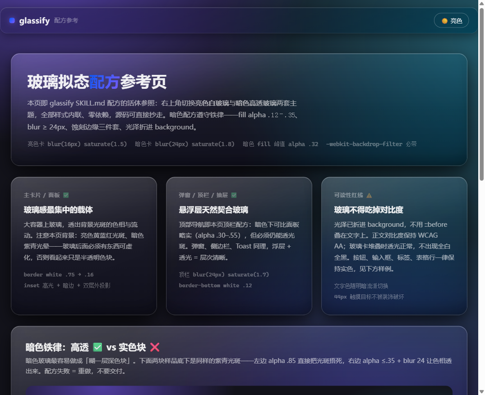
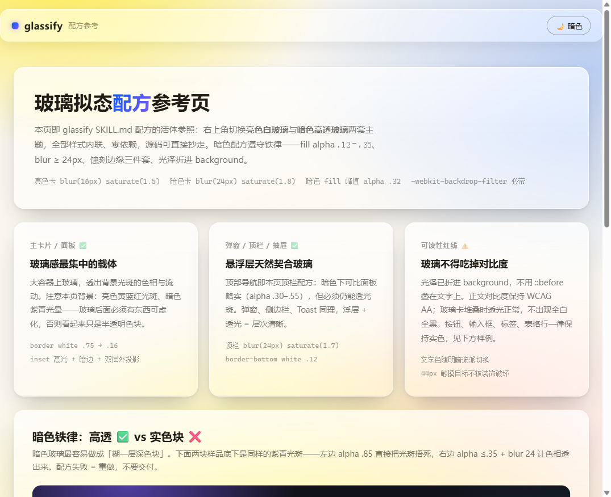

<!-- BADGE BAR -->
[](./LICENSE)
[](https://claude.ai)

# glassify

> **玻璃化改造师。** 把已有前端项目（手写 CSS / Tailwind / Flutter）改造为玻璃拟态（glassmorphism）风格——先问颜色，出方案确认，动手改造，视口截图验收。

| 亮色白玻璃 | 暗色高透玻璃 |
|:---:|:---:|
|  |  |

*↑ 配方活体参照页实拍，右上角一键切换主题——[在线交互预览](https://2021291696.github.io/glassify/)*

## 触发

```
/glassify <项目路径> [颜色说明]
```

或对 agent 说：**玻璃化 / glassify / 上玻璃 / 毛玻璃 / 磨砂**。适用于任何支持 SKILL.md 的 agent CLI（Claude Code / Codex / ZCode / Kimi 等）。

## 在线演示

**👉 [配方参考页（GitHub Pages 在线预览）](https://2021291696.github.io/glassify/)** —— 右上角切换亮色白玻璃 / 暗色高透玻璃双主题，含暗色铁律 ✅/❌ 对照样品、保持实色元素示例与玻璃化判定表。源码在 [`docs/index.html`](./docs/index.html)，全部内联零依赖，可直接抄走配方。

## 流程（两段式确认）

1. **技术栈探测** — 手写 CSS / Tailwind / Flutter 三栈自动识别，存疑时让用户确认
2. **颜色提问** — 预设色板 / 跟随项目主色 / 自定义描述，触发时已给色板则跳过
3. **方案确认** — 列出要动的文件与维持实色的元素，确认前零写入
4. **执行改造** — 内置亮色/暗色双配方（CSS + Tailwind 任意值 + Dart 三份），动手前过 git 干净闸口
5. **视口截图验收** — Playwright 视口截图，**禁 fullPage 长图**（backdrop-filter 在长图拼接时会钉死第一屏，产生拦腰截断伪影）
6. **可控回滚** — 逐文件恢复，禁止状态不明时无差别整体回滚

## 配方纪律（暗色铁律）

- fill alpha `.12–.35`，面板永远不许 ≥ `.60` —— 那是实色块，不是玻璃
- blur ≥ 24px + saturate ≥ 1.6，蚀刻边缘三件套（内嵌高光 + 内嵌暗边 + 双层外投影）必齐
- 光泽折进 `background`，禁止 `::before` 叠在文字上洗对比度
- 背景光斑必须又大又亮——玻璃后面没东西可虚化，看起来就只是半透明色块
- 手写 CSS 必须同时带 `-webkit-backdrop-filter`（Safari 至今要求前缀）
- 按钮 / 输入框 / 标签 / 表格行保持实色，可读性优先

## 安装

实体 + junction / 复制均可，放进你的 agent skills 目录即可：

```bash
git clone https://github.com/2021291696/glassify.git
cp glassify/SKILL.md <你的-agent>/skills/glassify/SKILL.md
```

## License

MIT
